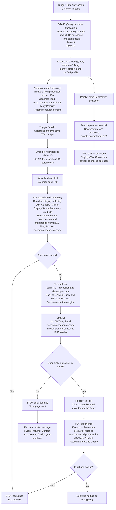

```mermaid
flowchart TD
  %% =========================
  %% DATA + TRIGGER
  %% =========================
  A[Trigger: First transaction<br/>Online or in store]
    --> B[GA4/BigQuery captures transaction<br/>User ID or Loyalty card ID<br/>Product IDs purchased<br/>Transaction count<br/>Amount<br/>Store ID]

  B --> C[Expose all GA4/BigQuery data to AB Tasty<br/>Identity stitching and unified profile]
  C --> D[Compute complementary products from purchased product IDs<br/>Generate Top 5 recommendations with AB Tasty Product Recommendations engine]

  %% =========================
  %% EMAIL ACTIVATION
  %% =========================
  D --> E[Trigger Email 1<br/>Objective: bring visitor to Web or App]
  E --> F[Email provider passes Visitor ID<br/>into AB Tasty landing URL parameters]
  F --> G[Visitor lands on PLP<br/>via email deep link]

  %% =========================
  %% ONSITE EXPERIENCE
  %% =========================
  G --> H[PLP experience in AB Tasty<br/>Reorder category or listing with AB Tasty API first<br/>Display 5 complementary products<br/>Recommendations override standard merchandising with AB Tasty Product Recommendations engine]

  %% =========================
  %% STOP CONDITION
  %% =========================
  H --> I{Purchase occurs?}
  I -- Yes --> Z[STOP sequence<br/>End journey]
  I -- No --> J[No purchase<br/>Send PLP impression and viewed products<br/>Back to GA4/BigQuery and AB Tasty Product Recommendations engine]

  %% =========================
  %% FOLLOW UP EMAIL
  %% =========================
  J --> K[Email 2<br/>Use AB Tasty Email Recommendations engine<br/>Include same products as PLP header]
  K --> L{User clicks a product in email?}

  %% Click path
  L -- Yes --> M[Redirect to PDP<br/>Click tracked by email provider and AB Tasty]
  M --> N[PDP experience<br/>Keep complementary products linked to recommended products by AB Tasty Product Recommendations engine]
  N --> O{Purchase occurs?}
  O -- Yes --> Z
  O -- No --> P[Continue nurture or retargeting]

  %% No click path
  L -- No --> Q[STOP email journey<br/>No engagement]
  Q --> R[Fallback onsite message<br/>If visitor returns: Contact an advisor to finalise your purchase]

  %% =========================
  %% PARALLEL STORE PUSH
  %% =========================
  C --> S[Parallel flow: Geolocation activation]
  S --> T[Push in person store visit<br/>Nearest store and directions<br/>Private appointment CTA]
  T --> U[If no click or purchase<br/>Display CTA: Contact an advisor to finalise purchase]
```
