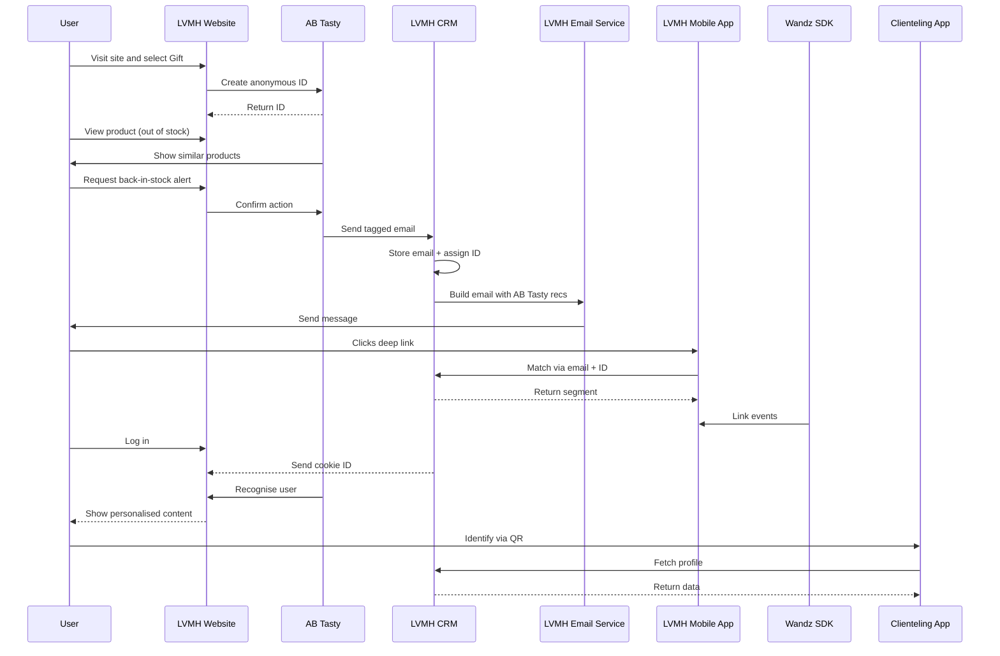
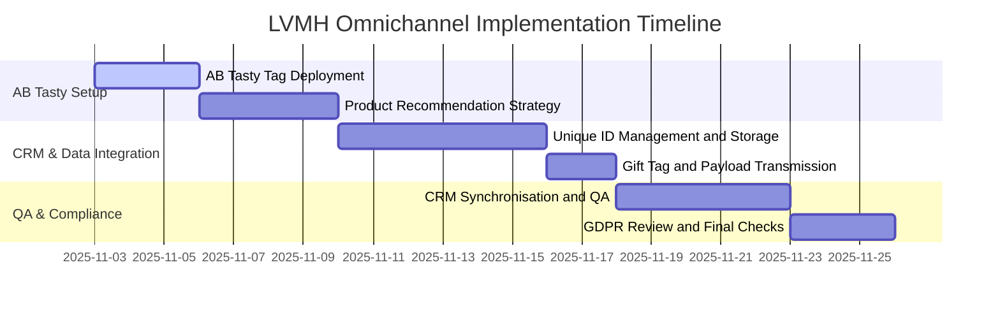
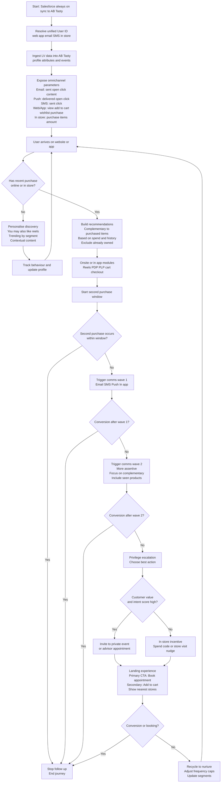

# LVMH Omnichannel Customer Journey and Data Flow

## Table of Contents
1. [Overview](#overview)
2. [Flowchart - Data Flow Between Systems](#flowchart---data-flow-between-systems)
3. [Sequence Diagram - Customer Journey Timeline](#sequence-diagram---customer-journey-timeline)
4. [Detailed Steps](#detailed-steps)
5. [Database and CRM Implications](#database-and-crm-implications)
6. [Notes](#notes)
7. [Development Requirements and Effort Breakdown](#development-requirements-and-effort-breakdown)
8. [Gantt Timeline](#gantt-timeline)

## Overview

This document outlines the **LVMH omnichannel customer journey** and associated **data flow** across digital and in-store systems.  
It demonstrates how **AB Tasty**, **LVMH CRM/Database**, **website**, **mobile app**, and **clienteling app** integrate to deliver a unified, GDPR-compliant experience.

## Flowchart - Data Flow Between Systems

```mermaid
flowchart LR
  classDef hub fill:#eef,stroke:#77a,stroke-width:1px;
  classDef gdpr fill:#efe,stroke:#7a7,stroke-width:1px;
  classDef key fill:#ffe,stroke:#aa7,stroke-width:1px;

  subgraph S1[Step 1 • LVMH Website visit]
    A1[Anonymous User visits Gift category on LVMH site]
    A2[AB Tasty creates anonymous ID]
    A3[User views product]
    A4{Out of stock?}
    A5[AB Tasty shows similar products]
    A6[Track views • clicks • filters]
    A1 --> A2 --> A3 --> A4
    A4 -- Yes --> A5 --> A6
    A4 -- No --> A6
  end

  subgraph S2[Step 2 • Back in stock alert]
    B1[User ignores recommendations]
    B2[Clicks back in stock alert]
    B3[Submits email]
    B4[Gift tag attached to email payload]
    B1 --> B2 --> B3 --> B4
  end

  subgraph S3[Step 3 • CRM Identification]
    C1[CRM stores email • sets unique ID]
    C2[User added to Gift segment]
    C3[CRM Email built with AB Tasty recs]
    C4[User clicks recommended Product]
    C1 --> C2 --> C3 --> C4
  end

  subgraph S4[Step 4 • Mobile App Interaction]
    D1[User lands in app]
    D2[Creates account]
    D3[CRM matches email]
    D4[Unique ID linked]
    D5[Wandz SDK links events]
    D1 --> D2 --> D3 --> D4 --> D5
  end

  subgraph S5[Step 5 • Web Login]
    E1[User logs back in]
    E2[AB Tasty recognises user via cookie]
    E3[Cross-channel personalisation]
    E1 --> E2 --> E3
  end

  subgraph S6[Step 6 • In-store Interaction]
    F1[User visits store]
    F2[Identifies via QR/barcode]
    F3[System fetches profile]
    F1 --> F2 --> F3
  end

  H[(LVMH CRM Hub)]
  class H hub
  K[Keys • Email • Unique ID • Segment • QR code]
  class K key

  A5 --> B1
  S2 --> S3
  C4 --> D1
  S4 --> S5
  S5 --> S6
  D3 --> H
  F3 --> H
  H --- K
```

## Sequence Diagram - Customer Journey Timeline

## Detailed Steps

### Step 1 • Website Visit
- Anonymous visit on Gift category.  
- AB Tasty creates anonymous ID.  
- Tracks product views, clicks, filters.  
- Shows recommendations if product is unavailable.

### Step 2 • Back-in-Stock Alert
- User requests email alert.  
- “Gift” tag attached to payload for segmentation.  
- CRM receives email and tag, not AB Tasty (GDPR).

### Step 3 • CRM Identification
- CRM creates unique ID and segments user attached to Email.  
- Sends follow-up email with AB Tasty product recommendations.

### Step 4 • Mobile App
- User opens email link in the LVMH app.  
- App matches email + ID with CRM upon Account Creation.  
- Wandz SDK tracks behaviour linked to ID.  

### Step 5 • Web Login
- Returning user logs in.  
- Cookie from CRM shows user ID to AB Tasty.  
- AB Tasty syncs profile for cross-channel personalisation.

### Step 6 • In-Store
- Clienteling app scans QR/barcode.  
- Fetches ID, email, history, and segment from CRM/Database.

## Database and CRM Implications

**Key identifiers:** Email, Unique ID, Segment tag (“Gift”), QR/barcode, Account info.  
**Central role:** LVMH CRM connects web, app, and store data into one consistent user record.

## Notes

- **AB Tasty:** Tracking, personalisation, recommendations, ID sync.  
- **CRM:** Central data and segmentation hub.  
- **Wandz SDK:** Collects event and creates AI predictive segmentations.  

## Development Requirements and Effort Breakdown

### 1. AB Tasty Web Tag Deployment
- Configure and validate across site.  
- Track key actions.  
**Effort:** 2–3 days

### 2. Product Recommendation Strategy
- Set up feed and Gift segment logic.  
- Add dynamic recommendations to CRM emails.  
**Effort:** 3–4 days

### 3. Unique ID Management
- Extend CRM API to generate/manage IDs.  
- Sync IDs between app and web.  
**Effort:** 5–6 days

### 4. Gift Tag and Payload Transmission
- Modify payloads to attach tag.  
- Update CRM ingestion logic.  
**Effort:** 2 days

### 5. CRM Synchronisation
- Validate consistency, GDPR compliance.  
**Effort:** 3–5 days

**Total Estimated Effort:** ~15–20 days (3–4 weeks)

## Timeline

# Salesforce → AB Tasty Always-on Personalisation Flow

